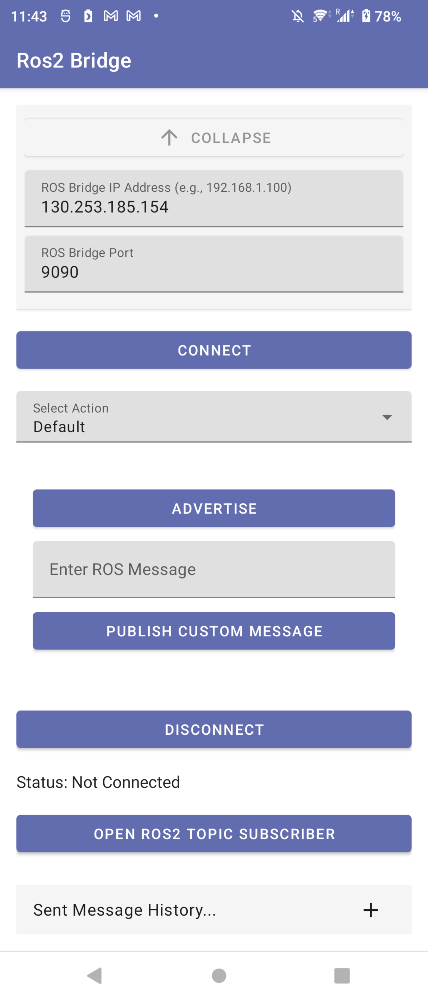
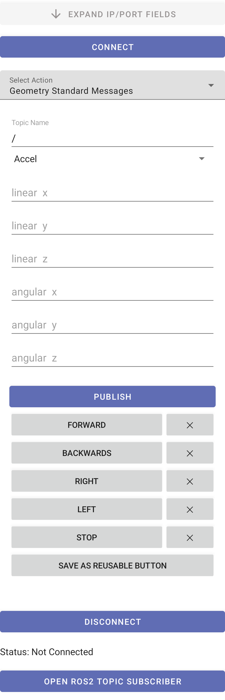
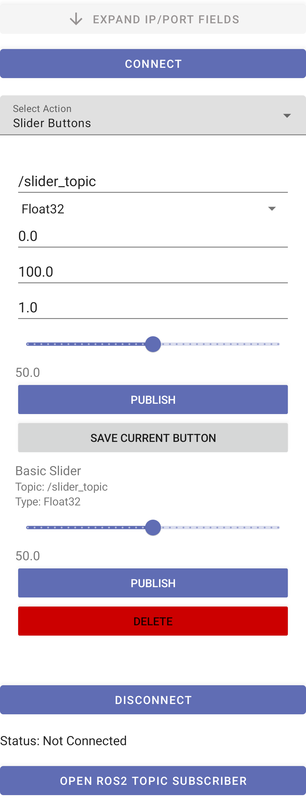
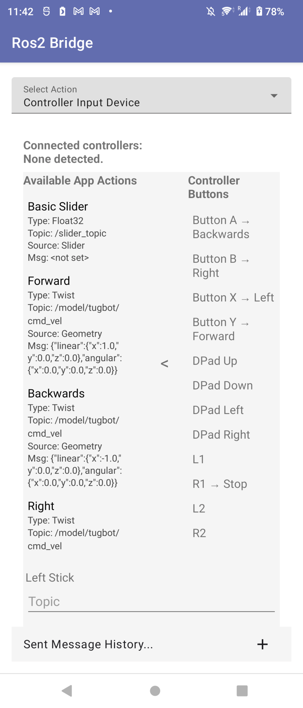
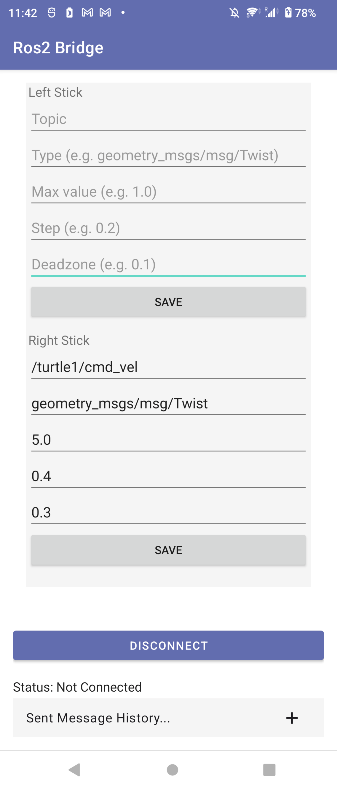

# Ros2BridgeMobile

## Description
Ros2BridgeMobile is an Android application that allows you to send messages from your mobile device to a ROS 2 client via rosbridge. It supports publishing standard and geometry messages, as well as using controller input for remote robot control. The app provides a user-friendly interface for connecting to a ROS 2 network, sending custom messages, and subscribing to topics in real time.

Key features:
- Connect to a ROS 2 network using rosbridge protocol
- Publish to any topic with custom or standard message types
- Save and reuse message templates
- Subscribe to and view live ROS 2 topics
- Use Android device controller/gamepad input to control robots
- Compose and send geometry_msgs and std_msgs interactively
- View message history and manage reusable message buttons

The app is built with Kotlin, Jetpack Compose, and Android best practices. It leverages OkHttp for networking and kotlinx.serialization for message handling.

## Table of Contents
- [Description](#description)
- [Installation](#installation)
- [Usage](#usage)
- [Credits](#credits)

## Installation
1. Clone this repository:
   ```sh
   git clone https://github.com/WinstonHar/Ros2BridgeMobile.git
   ```
2. Open the project in Android Studio.
3. Connect your Android device or start an emulator.
4. Build and run the app from Android Studio.

**Dependencies:**
- Android Studio (latest recommended)
- Android SDK 24+
- Internet connection to access your ROS 2 network
- ROS 2 setup with rosbridge_server running (see [rosbridge_suite](https://github.com/RobotWebTools/rosbridge_suite))

**Tested Equipment**
- Android 12 - Sony Xperia 1 II XQ-AT51 58.A.7.93
- Ros2 - Noble, Jazzy
- Android Studio 2025.1.1
## Usage
1. Start your ROS 2 network and ensure `rosbridge_server` is running (default port 9090).
2. Open Ros2 Bridge on your Android device.
3. Enter the IP address and port of your rosbridge server.
4. Connect to the server.
5. Use the dropdown to select different message types or features:
   - Default publisher
   - Custom publisher (standard messages)
   - Geometry standard messages
   - Slider controls (create and use)
   - Controller input device
6. Fill in message fields and publish, or subscribe to topics to view live data.
7. Save reusable messages for quick access.
8. Use the message history tab to review sent messages.

Specific instructions for using controller input for remote robot movement.
1. Start Ros 2 rosbridge_server on robot env.
2. Connect to IP and port of robot env while connected to the same wifi network.
3. Once connection is esablished select Geometry Standard Message action.
4. Enter topic name your robot is listening to. Note: if you switch off to a different 'action' your inputs will be erased
5. Select message type (for instance twist)
6. Fill in all values.
7. Save values using grey 'save as reusable button' button. Note: publish button allows you to directly advertise and publish values before saving. When pressed the app will prompt you to enter a name.
8. Save all buttons you need. Then swap to Controller Input Device Action.
9. On the left you can see the Available App Actions showing all your saved buttons, check to make sure they are correct, if not you can go back to the Geometry Standard Messages page and delete and rewrite a fixed version. The arrow in the center colapses this pane.
10. Assign controller buttons to actions. Note: They layout for android controller support follows the xbox layout.
11. Below is stick controls. Input 1 is tracked topic. Input 2 is message type. Input 3 is max value. Input 4 is step value(to control sensitivity/accelleration). Input 5 is deadzone (min value). Then save.
12. From here when you leave this action open the controller inputs (when connected to the bluetooth of the phone) will be mapped to the inputs you assigned.

**Screenshots:**
<div align="center">
  
  <br/><em>Main UI</em>
</div>
<div align="center">
  
  <br/><em>Custom Standard Messages Tab</em>
</div>
<div align="center">
  
  <br/><em>Geometry Standard Messages Tab</em>
</div>
<div align="center">
  
  <br/><em>Slider Button Tab</em>
</div>
<div align="center">
  
  <br/><em>Controller Input Tab-App Actions</em>
</div>
<div align="center">
  
  <br/><em>Controller Input Tab-Controller Button Assignment</em>
</div>
<div align="center">
  
  <br/><em>Controller Input Tab-Controller Joystick Assignment</em>
</div>

**Custom Protocol Support**
Now pre compile you can add custom messages. These are located in the root > app > src > main > assets > msgs folder.
In the msgs folder the structure must be as below to be registed in the UI automatically.
Msgs >
 -- action
 -- msg
 -- srv

The "action" folder should contain .action files
The "msg" folder should contain .msg files
The "srv" folder should contain .srv files

After adding in files to the respective folders they will show in the UI in their respective categories in a checkbox list. From there users can select which ones they want to use in the application and set custom buttons with prefilled values to use on the controller. 
Right now I have filters for text casing to exclude hint values. So only snake case variables in the files will be fillable while variables in all caps will be locked. This can be used to show what values correspond to different functions for fillable variables without writing external docs.

## Credits
- Developed by WinstonHar
- Uses [rosbridge_suite](https://github.com/RobotWebTools/rosbridge_suite) for ROS 2 communication
- Built with Kotlin, Jetpack Compose, OkHttp, and AndroidX libraries
- Icon: "Arrow Top 18" by Catalin Fertu, from the Bigmug Interface Icons collection  
  Licensed under [CC Attribution License](https://creativecommons.org/licenses/by/4.0/)  
  Source: [SVG Repo](https://www.svgrepo.com/svg/429771/arrow-top-18)
